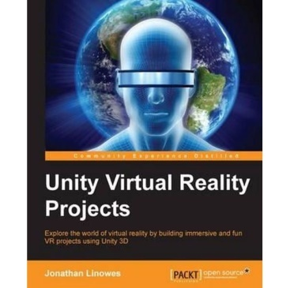
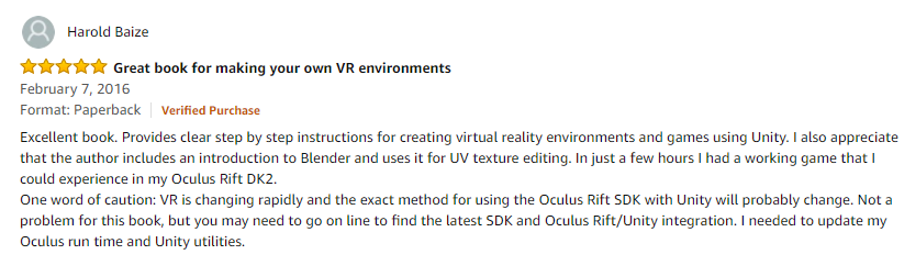
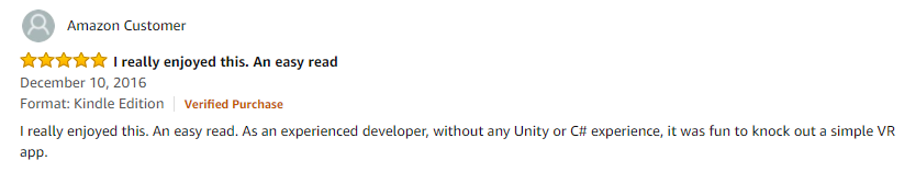

## [Get this title for $10 on Packt's Spring Sale](https://www.packt.com/B08826?utm_source=github&utm_medium=packt-github-repo&utm_campaign=spring_10_dollar_2022)
-----
For a limited period, all eBooks and Videos are only $10. All the practical content you need \- by developers, for developers

# Unity 3D

## Unity-Virtual-Reality-Projects
Explore the world of virtual reality(VR) by building immersive and fun VR projects using Unity 3D

## What is this book about?

What is consumer "virtual reality"? Wearing a head-mounted display you view stereoscopic 3D scenes. You can look around by moving your head, and walk around using hand controls or motion sensors. You are engaged in a fully immersive experience. On the other hand, Unity is a powerful game development engine that provides a rich set of features such as visual lighting, materials, physics, audio, special effects, and animation for creating 2D and 3D games. Unity 5 has become the leading platform for building virtual reality games, applications, and experiences for this new generation of consumer VR devices.
 

Using a practical and project-based approach, this book will educate you about the specifics of virtual reality development in Unity.You will learn how to use Unity to develop VR applications which can be experienced with devices such as the Oculus Rift or Google Cardboard. We will then learn how to engage with virtual worlds from a third person and first person character point of view. Furthermore, you will explore the technical considerations especially important and possibly unique to VR. The projects in the book will demonstrate how to build a variety of VR experiences. You will be diving into the Unity 3D game engine via the interactive Unity Editor as well as C-Sharp programming.
 

By the end of the book, you will be equipped to develop rich, interactive virtual reality experiences using Unity.
 

<b ><u >Key Features of Unity Virtual Reality Projects</u></b>
 
<ul><li>Learn the basic principles of virtual reality applications and get to know how they differ from games and desktop apps</li> 
<li>Build various types of VR experiences, including diorama, first-person characters, riding on rails, 360 degree projections, and social VR</li> 
<li>A project-based guide that teaches you to use Unity to develop VR applications, which can be experienced with devices such as the Oculus Rift or Google Cardboard</li> 
</ul>

## Who is this book for?

If you're a non-programmer unfamiliar with 3D computer graphics or experienced in both but new to virtual reality and are interested in building your own VR games or applications, then this book is for you. Any experience in Unity is an advantage. If you feel this book is for you, get your <a href="https://www.amazon.com/Virtual-Reality-Projects-Jonathan-Linowes/dp/178398855X/ref=asap_bc?ie=UTF8">copy</a> today!
 

## What will you learn from this book?
<ul><li>Create 3D scenes with Unity and Blender while learning about world space and scale</li> 
<li>Build and run VR applications for consumer headsets including Oculus Rift and Google Cardboard</li> 
<li>Build interactive environments with physics, gravity, animations, and lighting using the Unity engine</li> 
<li>Experiment with various user interface (UI) techniques that you can use in your VR applications</li> 
<li>Implement the first-person and third-person experiences that use only head motion gestures for input</li> 
<li>Create animated walkthroughs, use 360-degree media, and build multi-user social VR experiences</li> 
<li>Learn about the technology and psychology of VR including rendering, performance and VR motion sickness</li> 
<li>Gain introductory and advanced experience in Unity programming with the C# language</li> 
</ul>

## Amazon Reviews

 

 

 

 

<b ><u >Where can you buy this book?</u></b>
 
<ul><li>Amazon -<a href="https://www.amazon.com/Virtual-Reality-Projects-Jonathan-Linowes/dp/178398855X/ref=asap_bc?ie=UTF8">https://www.amazon.com/Virtual-Reality-Projects-Jonathan-Linowes/dp/178398855X/ref=asap_bc?ie=UTF8</a></li> 
<li>Packt- <a href="https://www.packtpub.com/game-development/unity-virtual-reality-projects?utm_source=github&amp;utm_medium=authorengagement&amp;utm_campaign=9781783988556">https://www.packtpub.com/game-development/unity-virtual-reality-projects?utm_source=github&amp;utm_medium=authorengagement&amp;utm_campaign=9781783988556</a> </li> 
</ul>

## Get to Know the Author

<i>Jonathan Linowes</i>
 

 

<i >Jonathan Linowes is principal at Parkerhill Reality Labs, an immersive media Indie studio. He is a veritable 3D graphics enthusiast, Unity developer, successful entrepreneur, and teacher. He has a fine arts degree from Syracuse University and a master's degree from the MIT Media Lab. He has founded several successful start-ups and held technical leadership positions at major corporations, including Autodesk Inc.</i>
 

<b ><i >Amazon</i></b><i > - </i><a href="https://www.amazon.com/Jonathan-Linowes/e/B01DFHE4T2"><i >https://www.amazon.com/Jonathan-Linowes/e/B01DFHE4T2</i></a>
 

<b ><i >GitHub</i></b><i > - </i><a href="https://github.com/linojon"><i >https://github.com/linojon</i></a>
 

 
</root>
